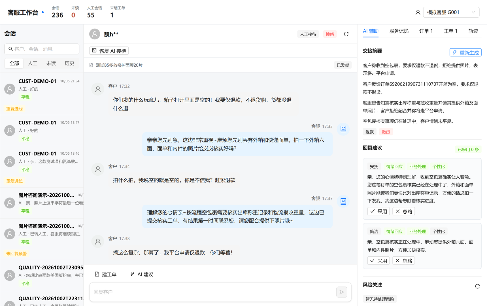
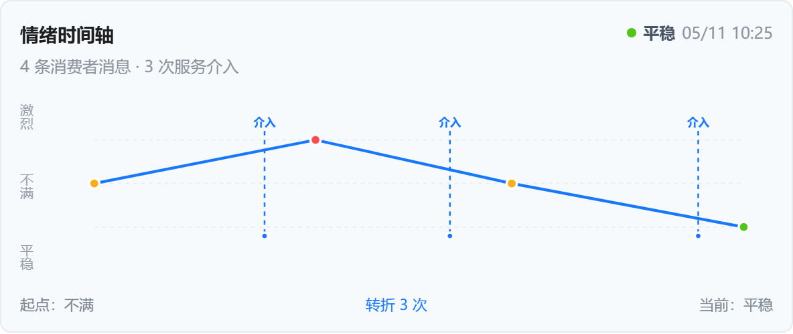
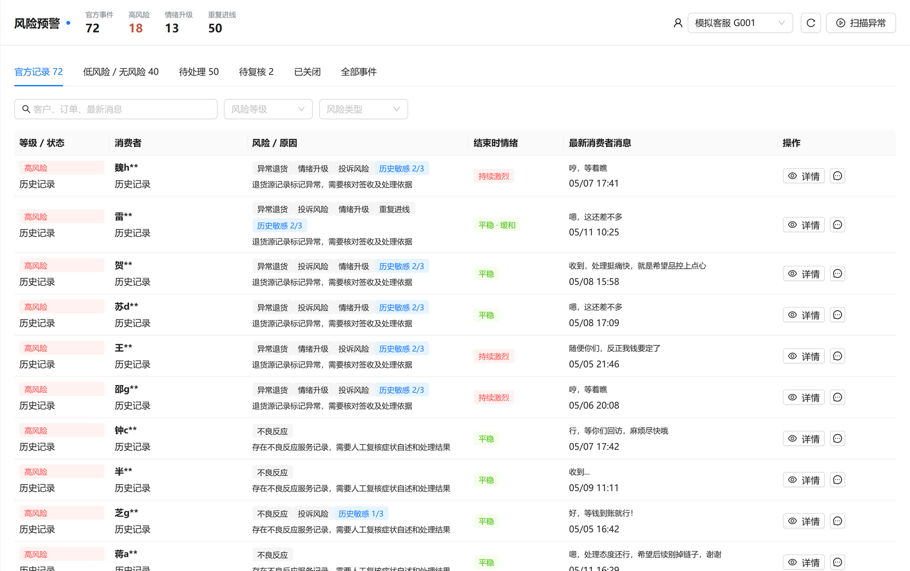
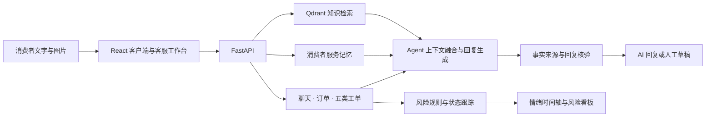

# 颜听 Yanting

**面向美妆电商的消费者 AI 管家与客服辅助工作台。**

消费者的担心、重复追问和此前的服务经历，常常散落在聊天、订单与售后记录里。颜听把这些信息连在一起，让客服快速了解“客户经历了什么、现在最在意什么、接下来怎样回应”。

项目来自欧莱雅 Beauty Techathon 赛题一「数据共情者」，包含智能接待辅助、消费者服务档案、情绪时间轴与风险跟踪看板。界面采用模拟千牛工作台布局，业务操作使用本地演示数据。

## 界面预览

### 客服工作台

左侧会话队列，中间完整聊天，右侧交接摘要、回复建议和共情标签。客服可以阅读上下文、采用建议、编辑回复并发送。



### 情绪时间轴

消费者消息按时间展示为情绪节点，客服与 AI 的回复标为介入点。点击节点可以查看完整原话、关键时间与情绪变化，也可打开对应会话；连续升级区间、触发因素和“对比上次”帮助客服理解变化过程。



### 风险预警看板

官方历史记录与当前服务事件分别展示，支持高、中、低风险及无风险视角。通过消费者原话、关联订单和工单追踪投诉、重复进线、情绪升级、等待超时和临期待办。



配图来自项目实际演示页面；图中消费者信息为赛题虚构、脱敏示例。

## 核心功能

| 模块 | 功能 |
| --- | --- |
| 客户聊天 | 多会话、文字与图片、上传及剪贴板粘贴、Enter 发送、Shift+Enter 换行 |
| AI 自动接待 | 结合当前聊天、订单、工单、服务记忆、知识检索和图片观察生成回复 |
| 人工接待辅助 | 2–5 句交接摘要、回复候选、采用与编辑、接管及恢复 AI 接待 |
| 共情与个性化 | 情绪回应、业务处理、个性化三个标签；结合肤质、顾虑和已尝试措施生成建议 |
| 消费者服务档案 | 跨会话诉求、历史回复、订单关联、四类服务记忆与完整服务轨迹 |
| 情绪时间轴 | 关键节点、服务介入、原话查看、升级区间、触发因素、上次进线对比 |
| 风险跟踪 | 风险分层、证据、处置负责人、人工复核、状态流转和操作审计 |
| 五类工单 | 补发换货、线下打款、物流、不良反应、售后退货的本地跟进 |
| 知识库 | 文档编辑、切片预览、商品关联、索引发布、启停与检索 |
| Prompt 与模型 | 提示词版本与绑定；文本、视觉、编码和重排模型配置 |

## 技术方案



- **前端**：React、TypeScript、Vite、Ant Design、Ant Design X。
- **后端**：FastAPI、Pydantic、SQLAlchemy、SQLite。
- **Agent**：服务上下文融合、LangGraph 状态编排、模型调用和操作审计。
- **检索**：Qdrant、本地 BGE-M3 编码、稠密与稀疏召回、可选 HTTP 重排。
- **模型**：兼容聊天补全接口的文本和视觉模型；模型名称、端点和凭证由后端配置。
- **验证工具**：pytest、Vitest、Playwright，评测任务位于 `evals/cases/`。

## 快速开始

下面步骤使用 Windows PowerShell。准备 Node.js **22.12+**、Python **3.11**、[uv](https://docs.astral.sh/uv/) 和模型服务凭证。

### 1. 获取源码与配置

```powershell
git clone https://github.com/huiyiyichen/yanting.git
cd yanting
Copy-Item .env.example services/api/.env
uv sync --project services/api --extra dev --no-editable
```

在 `services/api/.env` 中填入模型配置：

```dotenv
ANKER_AGENT_RUN_MODE=live
ANKER_AGENT_LLM_BASE_URL=
ANKER_AGENT_LLM_API_KEY=
ANKER_AGENT_LLM_MODEL=
ANKER_AGENT_LLM_VISION_MODEL=
ANKER_AGENT_EMBEDDING_BACKEND=onnx-local
ANKER_AGENT_EMBEDDING_MODEL_ID=BAAI/bge-m3
```

配置沿用 `ANKER_AGENT_` 前缀，项目界面名称为“颜听”。文本与视觉模型可分别填写服务商提供的模型 ID，凭证保存在本机后端配置。

### 2. 下载编码模型

```powershell
.\services\api\.venv\Scripts\python.exe -X utf8 scripts\fetch_embedding_model.py --repo BAAI/bge-m3 --allow-pattern "onnx/*"
```

ONNX 编码模型约 **2.29 GB**，默认缓存于 `%LOCALAPPDATA%\anker-agent\models`，后续启动复用缓存。也可在模型配置中使用远程编码服务。

### 3. 导入业务数据并发布知识

将已获授权的赛题 Excel 放到 `data/source/`，按文件实际路径导入：

```powershell
.\services\api\.venv\Scripts\python.exe -X utf8 scripts\import_business_data.py --source "data/source/赛题业务数据.xlsx"
.\services\api\.venv\Scripts\python.exe -X utf8 scripts\prepare_loreal_knowledge.py
```

Excel 包含聊天、订单、补发换货、线下打款、物流、不良反应和售后退货七张表；导入脚本按官方字段做关联及质量检查。知识发布在后端启动前执行。

原始赛题 Excel 通过赛事提供渠道取得；仓库提供导入代码、知识资料、来源登记和公开商品图片。`data/demo-images/loreal/` 中的图片适合演示“亲，这是什么商品呀？”场景，来源见同目录 `sources.json`。

### 4. 启动

```powershell
.\start-demo.cmd
```

启动入口安装或复用前后端依赖，并打开客服工作台。

| 页面 | 地址 |
| --- | --- |
| 客户视角 | http://127.0.0.1:5173/customer |
| 客服工作台 | http://127.0.0.1:5173/support |
| 风险预警 | http://127.0.0.1:5173/risk |
| API 文档 | http://127.0.0.1:8000/docs |

## 演示流程

1. 客服工作台打开一条官方会话，查看订单、售后工单和交接摘要。
2. 生成回复建议，查看共情标签，采用后编辑并发送。
3. 打开消费者服务档案，查看历史进线和连续服务轨迹。
4. 在风险看板打开详情，查看情绪节点、服务介入与消费者反馈。
5. 记录人工判断，完成风险处置与复核。
6. 切换客户视角，上传真实商品图片，体验图片咨询和双端消息联动。

## 仓库结构

```text
yanting/
├─ apps/web/              客户端、客服工作台与管理页面
├─ services/api/          业务 API、Agent、规则与后端测试
├─ data/
│  ├─ knowledge/          知识资料与商品来源
│  ├─ demo-images/        公开商品图片
│  └─ fixtures/           开发用例
├─ docs/
│  ├─ images/             README 精选截图
│  ├─ runbook/            配置、依赖与运行手册
│  └─ test-cases/         用例说明
├─ evals/cases/           评测任务
├─ scripts/               启动、导入、模型下载与评测脚本
├─ .env.example           空凭证配置模板
└─ start-demo.cmd         Windows 启动入口
```

## 开发命令

```powershell
# 后端测试
uv run --project services/api --extra dev pytest services/api/tests

# 前端类型检查、测试与构建
cd apps/web
npm ci
npm run typecheck
npm test
npm run build
```

这些是开发验证入口。项目的具体功能记录见 [功能说明](docs/项目功能说明.md)，配置详情见 [配置手册](docs/runbook/configuration.md)，依赖与许可证信息见 [依赖登记](docs/runbook/dependencies.md)。

## 数据与凭证

本机配置、运行数据库、原始 Excel、上传附件、模型缓存、日志和打包视频通过 `.gitignore` 管理。模型凭证填写在 `services/api/.env`；业务运行数据保存在 `data/runtime/`。

商品图片与公开资料的来源登记保留在 `data/demo-images/loreal/sources.json`、`data/knowledge/loreal/reference-products.json` 和 `consumer-sources.json` 中。
